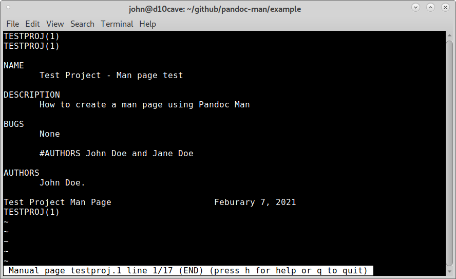

Pandoc Man
==========

Creating Linux Man pages using Pandoc.

Install Pandoc
::

	sudo apt install pandoc

Create and empty file named program_name.1.md and add the header.

testproj.1.md
::

	%TESTPROJ(1) Test Project Man Page
	%John B Doe, Jane Q Doe
	%Feburary 7, 2021

Sections start with # and end with a blank line.

Conventional section names include NAME, SYNOPSIS,  CONFIGURATION,
DESCRIPTION,  OPTIONS, EXIT STATUS,  RETURN VALUE,  ERRORS,
ENVIRONMENT,  FILES, VERSIONS, CONFORMING TO, NOTES, BUGS, EXAMPLE,
AUTHORS, and SEE ALSO.

Adding to our man page a couple of sections. Note that AUTHORS is
created in the header.

testproj.1.md
::

	%TESTPROJ(1) Test Project Man Page
	%John B Doe, Jane Q Doe
	%Feburary 7, 2021
	
	# NAME
	Test Project - Man page test
	
	# DESCRIPTION
	How to create a man page using Pandoc Man
	
	# BUGS
	None

To create the man file from the markdown file use the following syntax
::

	pandoc name.md --standalone --write FORMAT --output FILE

	--standalone - Produce output with an appropriate header and footer
	--write FORMAT - Specify output format
	--output FILE - Write  output  to  FILE instead of stdout.

This can be shortened to
::

	pandoc name.md -s -w FORMAT -o FILE

Open a terminal in the same directory as the file and use the following
to create the man page.
::

	pandoc testproj.1.md -s -w man -o testproj.1

To view the local man page use the `-l, --local-file` option like so
::

	man -l testproj.1

